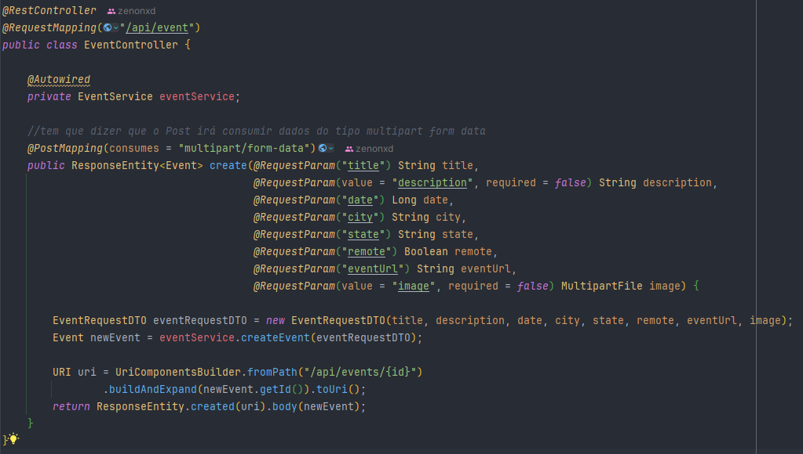
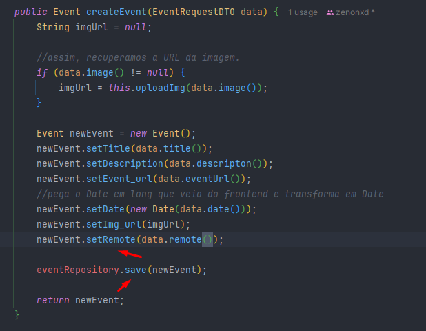

# Introdução

A ideia deste projeto é fixar meus conhecimentos em Java, Spring juntamente com Postgres e AWS.

[Video Fernanda Kipper](https://www.youtube.com/watch?v=d0KaNzAMVO4)

# Objetivo

Desenvolveremos um backend de uma aplicação para gerenciar eventos de tecnologia. Será permitido realizar:

- Cadastro;
- Listagem;
- Filtragem;
- Detalhamento de evento;
- Associação de cupons de desconto.

# Estrutura projeto

- [ ] O sistema deve permitir que o usuário cadastre um evento com os seguintes campos:

  - Titulo (obrigatório)
  - Descrição (opcional)
  - Data (obrigatório)
  - Local (obrigatório, se presencial)
  - Imagem (opcional)
  - URL do evento (obrigatório, se remoto)

- [ ] Eventos podem ser classificados como remotos ou presenciais

- [ ] O sistema deve permitir que o usuário associe um ou mais cupons de desconto a um evento. Cada cupom deve possuir os 
seguintes campos:

  - Código do cupom (obrigatório)
  - Desconto percentual ou valor fixo (obrigatório)
  - Data de validade (opcional)

- [ ] O sistema deve listar os eventos cadastrados, com paginação. A listagem deve incluir:

  - Título
  - Data
  - Local
  - Tipo (remoto ou presencial)
  - Banner
  - Descrição

- [ ] O sistema deve retornar somente eventos que ainda não aconteceram

- [ ] O sistema deve permitir que o usuário filtre a lista de eventos pelos seguintes critérios:

  - Título
  - Data
  - Local

- [ ] O sistema deve permitir que o usuário consulte todos os detalhes de um evento específico, incluindo:

  - Título
  - Descrição
  - Data
  - Local
  - Imagem
  - URL do evento
- Lista de cupons ativos, com seus respectivos detalhes (código do cupom, desconto, data de validade)

# Modelagem UML


# Infraestrutura 


A Nossa infraestrutura ficará dentro da AWS.

Nosso servidor java vai rodar em uma máquina EC2 Java Server. Essa máquina EC2 fará queries de leitura/escrita em um
banco de dados SQL (Amazon Aurora).

Na frente do nosso Java Server, teremos uma internet gateway. Ela será responsável por expor a nossa aplicação para a
internet.

O EC2 (servidor java) fará o upload das imagens em bucket da Amazon S3.

Assim que ele realizar o upload, ele vai pegar a URL correspondente e na hora de salvar o evento na tabela
do Amazon Aurora, ele irá também salvar a URL da imagem salva no S3.

Tudo isso ficará dentro de uma VPC (virtual private cloud), onde ficarão os nossos componentes (EC2, Aurora e Internet 
Gateway).

E dentro do VPC teremos uma subnet privada, que só poderá ser acessada pelos componentes que estiverem dentro da VPC.

Assim, o nosso banco não ficará exposto para internet.

# Dependências

- Spring web;
- PostgreSQL driver;
- Spring Data JPA;
- Lombok;
- Spring Boot DevTools (para live reload, etc)

# Criação de classes e mapeamento

Criar pacote domain. Dentro do domain, cada entidade terá seu pacote.

## Event (domain.event)

```java
@Entity
@Table(name = "event")
@NoArgsConstructor
@AllArgsConstructor
@Getter
@Setter
public class Event {

    @Id
    @GeneratedValue
    private UUID id;
    private String title;
    private String description;
    private Date date;
    private Boolean remote;
    private String img_url;
    private String event_url;
}
```

## Coupon (domain.coupon)

```java
@Entity
@Table(name = "coupon")
@NoArgsConstructor
@AllArgsConstructor
@Getter
@Setter
public class Coupon {

    @Id
    @GeneratedValue
    private UUID id;
    private Integer discount;
    private String code;
    private Date valid;

    @ManyToOne
    @JoinColumn(name = "event_id")
    private Event event;
}
```

## Address (domain.address)

```java
@Entity
@Table(name = "address")
@NoArgsConstructor
@AllArgsConstructor
@Getter
@Setter
public class Address {

    private UUID id;
    private String uf;
    private String city;

    @ManyToOne
    @JoinColumn(name = "event_id")
    private Event event;
}
```

# Criando repositories

## EventRepository

## CouponRepository

## EventRepository

# Configurando banco de dados

## application.properties

```properties
spring.application.name=api

spring.datasource.url=jdbc:postgresql://localhost:5433/eventostec
spring.datasource.username=postgres
spring.datasource.password=password aqui
```

# Criação de script sql para migração de dados (flyway)

O flyway é responsável por criar as migrations, ou seja, os arquivos que mantém o histórico do esquema do nosso
banco de dados.

## Dependência flyway

```xml
<dependency>
    <groupId>org.flywaydb</groupId>
    <artifactId>flyway-core</artifactId>
</dependency>
```

## Resources (criando pasta Script.sql - migrations)

Criaremos dois diretórios:

1. db
2. Dentro do db um outro chamado migration

Dentro desse diretório, criaremos a nossa primeira migration. Se chamará ``V1__create-event-table.sql``.

Neste arquivo, colocaremos o comando de criar a tabela:

get_random_uuid é uma função de uma extensão do Postgres onde iremos instalar depois, ela irá gerar uma random UUID.

PRIMARY KEY = chave que identifica unicamente as entradas dessa tabela.

Para rodar o código, conecte a base de dados do PostgreSQL.

### Create event table

```postgresql
CREATE EXTENSION IF NOT EXISTS "pgcrypto";

CREATE TABLE event (
    /*
    get_random_uuid é uma função
    de uma extensão do Postgres
    onde iremos instalar depois.
    Ela irá gerar uma random UUID
    */
  id UUID DEFAULT gen_random_uuid() PRIMARY KEY,
  title VARCHAR(100) NOT NULL,
  description VARCHAR(200) NOT NULL,
  img_url VARCHAR(100) NOT NULL,
  event_url VARCHAR(100) NOT NULL,
  date TIMESTAMP NOT NULL,
  remote BOOLEAN NOT NULL
);
```

### Create coupon table

Crie o migration ``V2__create-coupon-table``

Para associar o evento a esta tabela, nomeamos a sua coluna "event_id" e embaixo, colocamos que será uma chave
estrangeira referenciada a tabela event (campo id).

O ON DELETE CASCADE significa que, caso esse evento seja deletado, o cupom também será.

```postgresql
CREATE TABLE  coupon (
    id UUID DEFAULT  gen_random_uuid() PRIMARY KEY,
    code VARCHAR(100) NOT NULL,
    discount INTEGER NOT NULL,
    valid TIMESTAMP NOT NULL,
    event_id UUID,
    FOREIGN KEY (event_id) REFERENCES event(id) ON DELETE CASCADE
)
```

### Create address table

rie o migration ``V3__create-adress-table``

Para associar o evento a esta tabela, nomeamos a sua coluna "event_id" e embaixo, colocamos que será uma chave
estrangeira referenciada a tabela event (campo id).

O ON DELETE CASCADE significa que, caso esse evento seja deletado, o cupom também será.

```postgresql
CREATE TABLE  address (
    id UUID DEFAULT gen_random_uuid() PRIMARY KEY,
    city VARCHAR(100) NOT NULL,
    uf VARCHAR(100) NOT NULL,
    event_id UUID,
    FOREIGN KEY (event_id) REFERENCES event(id) ON DELETE CASCADE
)
```


# DTO's

## Criando DTOS

Dentro do pacote de cada entidade, criaremos um Record como DTO. Ou seja, em ``domain.event``, teremos na mesma
pasta a entidade ``Event`` e um record ``EventRequestDTO``.

Essa imagem será transformada em um arquivo depois para upar no S3, onde eventualmente essa URL será recuperada e inserida
no banco de dados.

A date será long porque provavelmente receberemos do frontend (javascript) um timestamp.

```java
public record EventRequestDTO(String title, String descripton,
                              Long date, String city,
                              String state, Boolean remote,
                              String eventUrl, MultipartFile image) {
}
```

# Service

### EventService

O primeiro endpoint que iremos fazer é para o usuário cadastrar evento.

[ ] O sistema deve permitir que o usuário cadastre um evento com os seguintes campos:

- Titulo (obrigatório)
- Descrição (opcional)
- Data (obrigatório)
- Local (obrigatório, se presencial)
- Imagem (opcional)
- URL do evento (obrigatório, se remoto)

O método se chamará CreateEvent e receberá um EventRequestDTO.

Iniciaremos o método criando uma String de imgURL. Caso ela seja diferente de nula, faremos o upload dela no S3.

```java
public Event createEvent(EventRequestDTO data) {
    String imgUrl = null;

    //assim, recuperamos a URL da imagem.
    if (data.image() != null) {
        imgUrl = this.uploadImg(data.image());
    }

    Event newEvent = new Event();
    newEvent.setTitle(data.title());
    newEvent.setDescription(data.descripton());
    newEvent.setEvent_url(data.eventUrl());
    //pega o Date em long que veio do frontend e transforma em Date
    newEvent.setDate(new Date(data.date()));
    newEvent.setImg_url(imgUrl);
        
    return newEvent;
}
```

#### Fazendo upload da imagem no bucket S3

Instalaremos a SDK da AWS para conectarmos com S3 e fazer o upload da imagem.

##### Dependência S3

```xml
<dependency>
    <groupId>com.amazonaws</groupId>
    <artifactId>aws-java-sdk-s3</artifactId>
    <version>1.11.913</version>
</dependency>
```

##### AWSConfig

Criaremos um pacote ``config`` com a classe ``AWSConfig``. Essa classe será responsável por criar uma instância do 
Amazon S3 com as nossas credenciais.

Criaremos um atributo para alocar a variável de região do AWS.

```properties
aws.region=us-east-1
```

```java
@Configuration
public class AWSConfig {

    @Value("${aws.region}")
    private String awsRegion;

    @Bean
    public AmazonS3 createS3Instance() {
        return AmazonS3ClientBuilder
                //usará as configurações standard configuradas
                //no computador
                .standard()
                .withRegion(awsRegion).build();
    }
}
```

Configure a AWS no computador para não precisar passar tudo dentro do método.

##### Configurando AWS

Baixe o [CLI](https://aws.amazon.com/pt/cli/)

Configurar suas credenciais AWS: Após instalar o AWS CLI, execute o comando abaixo para configurar suas credenciais (Access Key ID e Secret Access Key):

bash
> aws configure

Isso vai pedir as informações:

- AWS Access Key ID: A chave de acesso que você obteve na AWS.
- AWS Secret Access Key: A chave secreta correspondente.
- Default region name: A região onde os seus serviços estão configurados (ex: us-east-1, sa-east-1 para São Paulo).
- Default output format: O formato da saída (pode ser json).

Essas informações ficam salvas no arquivo ~/.aws/credentials (no Linux/macOS) ou C:\Users\YourUserName\.aws\credentials 
(no Windows).

Verificar a configuração: Para garantir que as suas credenciais estão configuradas corretamente, você pode usar o comando:

bash
> aws s3 ls

Voltaremos para o EventService e injetaremos a classe do ``AWSConfig``.

```java
@Service
public class EventService {

    @Autowired
    public AmazonS3 s3Client;
}
```

E agora, vamos para o método de upload.

##### uploadImg - AmazonS3 (EventService)

```java
    private String uploadImg(MultipartFile multipartFile) {
        //nome que a imagem será salva
        String fileName = UUID.randomUUID() + "-" + multipartFile.getOriginalFilename();

        //conversao de arquivo para um File de verdade
        try {
            File file = this.convertMultipartToFile(multipartFile);
            s3Client.putObject(bucketName, fileName, file);

            //deleta esse file de cima (arquivo temporário para fazer o upload)
            file.delete();

            //pegando a url criada
            return s3Client.getUrl(bucketName, fileName).toString();

        } catch (Exception e) {
            System.out.println("erro ao subir arquivo");
            return null;
        }
    }
```

###### convertMultipartToFile

```java
    //pegamos o que recebemos no request, criamos um arquivo local na máquina
    private File convertMultipartToFile(MultipartFile multipartFile) throws Exception {
        //dessa forma ele terá certeza que o objeto não será nulo
        File convFile = new File(Objects.requireNonNull(multipartFile.getOriginalFilename()));

        FileOutputStream fos = new FileOutputStream(convFile);
        fos.write(multipartFile.getBytes());
        fos.close();

        return convFile;
    }
```

Agora, precisamos ir na AWS, criar o bucket (deixando-o público) para qualquer um visualizar.

# Criando bucket AWS

[Link](https://us-east-2.console.aws.amazon.com/s3/buckets?region=us-east-2#)

Criaremos um bucket S3 para conter as imagens do site e vamos configurar para ele ser publicamente acessível e também
para os usuários realizarem upload.

Nome do bucket: eventostec-imagens

Terá as suas ACLS desabilitadas, desmarca o "Bloquear todo o acesso público" e marque "Reconheço que as configurações 
atuais podem fazer com que este bucket e os objetos dentro dele se tornem públicos."

Crie o bucket!

Agora selecione ele, vá em permissões e vá em "política de bucket" ⇒ editar.

Precisamos colocar uma política para permitir que todos possam ter acesso.

```json
{
  "Version": "2012-10-17",
  "Statement": [
    {
      "Sid": "PublicReadGetObject",
      "Effect": "Allow",
      "Principal": "*",
      "Action": "s3:GetObject",
      "Resource": "arn:aws:s3:::eventostec-imagens-p/*"
    }
  ]
}
```

Agora, podemos carregar uma imagem e testar se ela ficará publicamente acessível.

Vá em objetos ⇒ carregar imagem e upe alguma.

Clique nela e vá nas suas propriedades para pegar a URL.

Agora vamos construir o nosso controller para fazer uma chamada de teste!

# Controller

Criar pacote controllers e nosso ``EventController``.

Importar o service.

## Create

Não podemos deixar como parâmetro, somente o DTO com @RequestBody. Caso contrário, quando formos realizar a operação
no Postman, teremos um erro 415 Unsupported Media Type. Precisamos tratar de Multipart (que vem do postman), para o objeto
desejado.

Para isso, iremos mapear cada parâmetro através do @RequestParam.



## Requisição Postman teste


Entretanto, o remote e id vieram null. Então faremos algumas validações.

Esses dois campos null se resolvem importando o EventRepository e dando save e instanciando o remote!



