# Introdução

A ideia deste projeto é fixar meus conhecimentos em Java, Spring juntamente com Postgres e AWS.

[Video Fernanda Kipper](https://www.youtube.com/watch?v=d0KaNzAMVO4)

# Objetivo

Desenvolveremos um backend de uma aplicação para gerenciar eventos de tecnologia. Será permitido realizar:

- Cadastro;
- Listagem;
- Filtragem;
- Detalhamento de evento;
- Associação de cupons de desconto.

# Estrutura projeto

- [ ] O sistema deve permitir que o usuário cadastre um evento com os seguintes campos:

  - Titulo (obrigatório)
  - Descrição (opcional)
  - Data (obrigatório)
  - Local (obrigatório, se presencial)
  - Imagem (opcional)
  - URL do evento (obrigatório, se remoto)

- [ ] Eventos podem ser classificados como remotos ou presenciais

- [ ] O sistema deve permitir que o usuário associe um ou mais cupons de desconto a um evento. Cada cupom deve possuir os 
seguintes campos:

  - Código do cupom (obrigatório)
  - Desconto percentual ou valor fixo (obrigatório)
  - Data de validade (opcional)

- [ ] O sistema deve listar os eventos cadastrados, com paginação. A listagem deve incluir:

  - Título
  - Data
  - Local
  - Tipo (remoto ou presencial)
  - Banner
  - Descrição

- [ ] O sistema deve retornar somente eventos que ainda não aconteceram

- [ ] O sistema deve permitir que o usuário filtre a lista de eventos pelos seguintes critérios:

  - Título
  - Data
  - Local

- [ ] O sistema deve permitir que o usuário consulte todos os detalhes de um evento específico, incluindo:

  - Título
  - Descrição
  - Data
  - Local
  - Imagem
  - URL do evento
- Lista de cupons ativos, com seus respectivos detalhes (código do cupom, desconto, data de validade)

# Modelagem UML

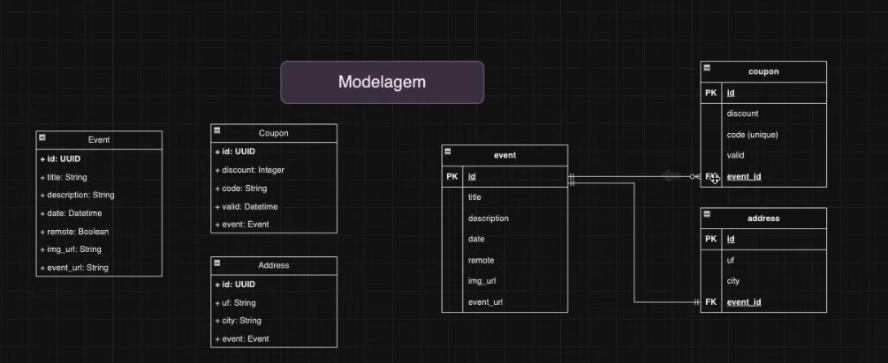

# Infraestrutura 

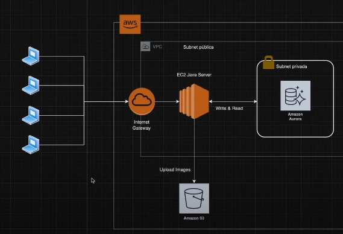

A Nossa infraestrutura ficará dentro da AWS.

Nosso servidor java vai rodar em uma máquina EC2 Java Server. Essa máquina EC2 fará queries de leitura/escrita em um
banco de dados SQL (Amazon Aurora).

Na frente do nosso Java Server, teremos uma internet gateway. Ela será responsável por expor a nossa aplicação para a
internet.

O EC2 (servidor java) fará o upload das imagens em bucket da Amazon S3.

Assim que ele realizar o upload, ele vai pegar a URL correspondente e na hora de salvar o evento na tabela
do Amazon Aurora, ele irá também salvar a URL da imagem salva no S3.

Tudo isso ficará dentro de uma VPC (virtual private cloud), onde ficarão os nossos componentes (EC2, Aurora e Internet 
Gateway).

E dentro do VPC teremos uma subnet privada, que só poderá ser acessada pelos componentes que estiverem dentro da VPC.

Assim, o nosso banco não ficará exposto para internet.

# Dependências

- Spring web;
- PostgreSQL driver;
- Spring Data JPA;
- Lombok;
- Spring Boot DevTools (para live reload, etc)

# Criação de classes e mapeamento

Criar pacote domain. Dentro do domain, cada entidade terá seu pacote.

## Event (domain.event)

```java
@Entity
@Table(name = "event")
@NoArgsConstructor
@AllArgsConstructor
@Getter
@Setter
public class Event {

    @Id
    @GeneratedValue
    private UUID id;
    private String title;
    private String description;
    private Date date;
    private Boolean remote;
    private String img_url;
    private String event_url;
}
```

## Coupon (domain.coupon)

```java
@Entity
@Table(name = "coupon")
@NoArgsConstructor
@AllArgsConstructor
@Getter
@Setter
public class Coupon {

    @Id
    @GeneratedValue
    private UUID id;
    private Integer discount;
    private String code;
    private Date valid;

    @ManyToOne
    @JoinColumn(name = "event_id")
    private Event event;
}
```

## Address (domain.address)

```java
@Entity
@Table(name = "address")
@NoArgsConstructor
@AllArgsConstructor
@Getter
@Setter
public class Address {

    private UUID id;
    private String uf;
    private String city;

    @ManyToOne
    @JoinColumn(name = "event_id")
    private Event event;
}
```

# Criando repositories

## EventRepository

## CouponRepository

## EventRepository

# Configurando banco de dados

## application.properties

```properties
spring.application.name=api

spring.datasource.url=jdbc:postgresql://localhost:5433/eventostec
spring.datasource.username=postgres
spring.datasource.password=password aqui
```

# Criação de script sql para migração de dados (flyway)

O flyway é responsável por criar as migrations, ou seja, os arquivos que mantém o histórico do esquema do nosso
banco de dados.

## Dependência flyway

```xml
<dependency>
    <groupId>org.flywaydb</groupId>
    <artifactId>flyway-core</artifactId>
</dependency>
```

## Resources (criando pasta Script.sql - migrations)

Criaremos dois diretórios:

1. db
2. Dentro do db um outro chamado migration

Dentro desse diretório, criaremos a nossa primeira migration. Se chamará ``V1__create-event-table.sql``.

Neste arquivo, colocaremos o comando de criar a tabela:

get_random_uuid é uma função de uma extensão do Postgres onde iremos instalar depois, ela irá gerar uma random UUID.

PRIMARY KEY = chave que identifica unicamente as entradas dessa tabela.

Para rodar o código, conecte a base de dados do PostgreSQL.

### Create event table

```postgresql
CREATE EXTENSION IF NOT EXISTS "pgcrypto";

CREATE TABLE event (
    /*
    get_random_uuid é uma função
    de uma extensão do Postgres
    onde iremos instalar depois.
    Ela irá gerar uma random UUID
    */
  id UUID DEFAULT gen_random_uuid() PRIMARY KEY,
  title VARCHAR(100) NOT NULL,
  description VARCHAR(200) NOT NULL,
  img_url VARCHAR(100) NOT NULL,
  event_url VARCHAR(100) NOT NULL,
  date TIMESTAMP NOT NULL,
  remote BOOLEAN NOT NULL
);
```

### Create coupon table

Crie o migration ``V2__create-coupon-table``

Para associar o evento a esta tabela, nomeamos a sua coluna "event_id" e embaixo, colocamos que será uma chave
estrangeira referenciada a tabela event (campo id).

O ON DELETE CASCADE significa que, caso esse evento seja deletado, o cupom também será.

```postgresql
CREATE TABLE  coupon (
    id UUID DEFAULT  gen_random_uuid() PRIMARY KEY,
    code VARCHAR(100) NOT NULL,
    discount INTEGER NOT NULL,
    valid TIMESTAMP NOT NULL,
    event_id UUID,
    FOREIGN KEY (event_id) REFERENCES event(id) ON DELETE CASCADE
)
```

### Create address table

rie o migration ``V3__create-adress-table``

Para associar o evento a esta tabela, nomeamos a sua coluna "event_id" e embaixo, colocamos que será uma chave
estrangeira referenciada a tabela event (campo id).

O ON DELETE CASCADE significa que, caso esse evento seja deletado, o cupom também será.

```postgresql
CREATE TABLE  address (
    id UUID DEFAULT gen_random_uuid() PRIMARY KEY,
    city VARCHAR(100) NOT NULL,
    uf VARCHAR(100) NOT NULL,
    event_id UUID,
    FOREIGN KEY (event_id) REFERENCES event(id) ON DELETE CASCADE
)
```


# DTO's

## Criando DTOS

Dentro do pacote de cada entidade, criaremos um Record como DTO. Ou seja, em ``domain.event``, teremos na mesma
pasta a entidade ``Event`` e um record ``EventRequestDTO``.

Essa imagem será transformada em um arquivo depois para upar no S3, onde eventualmente essa URL será recuperada e inserida
no banco de dados.

A date será long porque provavelmente receberemos do frontend (javascript) um timestamp.

```java
public record EventRequestDTO(String title, String descripton,
                              Long date, String city,
                              String state, Boolean remote,
                              String eventUrl, MultipartFile image) {
}
```

# Criando Endpoints

RequestDTO = Não tem ID, é o que é passado no parâmetro.

ResponseDTO = Tem id, é o retorno.

## Create Event

- [ ] O sistema deve permitir que o usuário cadastre um evento com os seguintes campos:

  - Titulo (obrigatório)
  - Descrição (opcional)
  - Data (obrigatório)
  - Local (obrigatório, se presencial)
  - Imagem (opcional)
  - URL do evento (obrigatório, se remoto)

- [ ] Eventos podem ser classificados como remotos ou presenciais

Como vamos cadastrar uma imagem no S3, iremos começar por isso.

### Service

O método se chamará CreateEvent, receberá um EventRequestDTO e retornará um EventResponseDTO.

Iniciaremos o método criando uma String de imgURL. Caso ela seja diferente de nula, faremos o upload dela no S3.

⬇️ Este método é um exemplo! Ele NÃO ficará assim.
```java
public Event createEvent(EventRequestDTO data) {
    String imgUrl = null;

    //assim, recuperamos a URL da imagem.
    if (data.image() != null) {
        imgUrl = this.uploadImg(data.image());
    }

    Event newEvent = new Event();
    newEvent.setTitle(data.title());
    newEvent.setDescription(data.descripton());
    newEvent.setEvent_url(data.eventUrl());
    //pega o Date em long que veio do frontend e transforma em Date
    newEvent.setDate(new Date(data.date()));
    newEvent.setImg_url(imgUrl);
        
    return newEvent;
}
```

#### Fazendo upload da imagem no bucket S3

Instalaremos a SDK da AWS para conectarmos com S3 e fazer o upload da imagem.

#### Dependência S3

```xml
<dependency>
    <groupId>com.amazonaws</groupId>
    <artifactId>aws-java-sdk-s3</artifactId>
    <version>1.11.913</version>
</dependency>
```

#### AWSConfig

Criaremos um pacote ``config`` com a classe ``AWSConfig``. Essa classe será responsável por criar uma instância do 
Amazon S3 com as nossas credenciais.

Criaremos um atributo para alocar a variável de região do AWS.

```properties
aws.region=us-east-1
```

```java
@Configuration
public class AWSConfig {

    @Value("${aws.region}")
    private String awsRegion;

    @Bean
    public AmazonS3 createS3Instance() {
        return AmazonS3ClientBuilder
                //usará as configurações standard configuradas
                //no computador
                .standard()
                .withRegion(awsRegion).build();
    }
}
```

Configure a AWS no computador para não precisar passar tudo dentro do método.

#### Configurando AWS

Baixe o [CLI](https://aws.amazon.com/pt/cli/)

Configurar suas credenciais AWS: Após instalar o AWS CLI, execute o comando abaixo para configurar suas credenciais (Access Key ID e Secret Access Key):

bash
> aws configure

Isso vai pedir as informações:

- AWS Access Key ID: A chave de acesso que você obteve na AWS.
- AWS Secret Access Key: A chave secreta correspondente.
- Default region name: A região onde os seus serviços estão configurados (ex: us-east-1, sa-east-1 para São Paulo).
- Default output format: O formato da saída (pode ser json).

Essas informações ficam salvas no arquivo ~/.aws/credentials (no Linux/macOS) ou C:\Users\YourUserName\.aws\credentials 
(no Windows).

Verificar a configuração: Para garantir que as suas credenciais estão configuradas corretamente, você pode usar o comando:

bash
> aws s3 ls

Voltaremos para o EventService e injetaremos a classe do ``AWSConfig``.

```java
@Service
public class EventService {

    @Autowired
    public AmazonS3 s3Client;
}
```

E agora, vamos para o método de upload.

#### uploadImg - AmazonS3 (EventService)

```java
    private String uploadImg(MultipartFile multipartFile) {
        //nome que a imagem será salva
        String fileName = UUID.randomUUID() + "-" + multipartFile.getOriginalFilename();

        //conversao de arquivo para um File de verdade
        try {
            File file = this.convertMultipartToFile(multipartFile);
            s3Client.putObject(bucketName, fileName, file);

            //deleta esse file de cima (arquivo temporário para fazer o upload)
            file.delete();

            //pegando a url criada
            return s3Client.getUrl(bucketName, fileName).toString();

        } catch (Exception e) {
            System.out.println("erro ao subir arquivo");
            return null;
        }
    }
```

#### convertMultipartToFile

```java
    //pegamos o que recebemos no request, criamos um arquivo local na máquina
    private File convertMultipartToFile(MultipartFile multipartFile) throws Exception {
        //dessa forma ele terá certeza que o objeto não será nulo
        File convFile = new File(Objects.requireNonNull(multipartFile.getOriginalFilename()));

        FileOutputStream fos = new FileOutputStream(convFile);
        fos.write(multipartFile.getBytes());
        fos.close();

        return convFile;
    }
```

Agora, precisamos ir na AWS, criar o bucket (deixando-o público) para qualquer um visualizar.

#### Criando bucket AWS

[Link](https://us-east-2.console.aws.amazon.com/s3/buckets?region=us-east-2#)

Criaremos um bucket S3 para conter as imagens do site e vamos configurar para ele ser publicamente acessível e também
para os usuários realizarem upload.

Nome do bucket: eventostec-imagens

Terá as suas ACLS desabilitadas, desmarca o "Bloquear todo o acesso público" e marque "Reconheço que as configurações 
atuais podem fazer com que este bucket e os objetos dentro dele se tornem públicos."

Crie o bucket!

Agora selecione ele, vá em permissões e vá em "política de bucket" ⇒ editar.

Precisamos colocar uma política para permitir que todos possam ter acesso.

```json
{
  "Version": "2012-10-17",
  "Statement": [
    {
      "Sid": "PublicReadGetObject",
      "Effect": "Allow",
      "Principal": "*",
      "Action": "s3:GetObject",
      "Resource": "arn:aws:s3:::eventostec-imagens-p/*"
    }
  ]
}
```

Agora, podemos carregar uma imagem e testar se ela ficará publicamente acessível.

Vá em objetos ⇒ carregar imagem e upe alguma.

Clique nela e vá nas suas propriedades para pegar a URL.

Agora vamos construir o nosso controller para fazer uma chamada de teste!

### Método Service Final

[Create Event](https://github.com/zenonxd/backend-model-2024/blob/99e1e5eaecda180958b6cb9a3a84fecfd598a219/src/main/java/com/eventostec/api/services/EventService.java#L41)

[Método para upar imagem no S3](https://github.com/zenonxd/backend-model-2024/blob/99e1e5eaecda180958b6cb9a3a84fecfd598a219/src/main/java/com/eventostec/api/services/EventService.java#L80)

[Método convertendo file](https://github.com/zenonxd/backend-model-2024/blob/99e1e5eaecda180958b6cb9a3a84fecfd598a219/src/main/java/com/eventostec/api/services/EventService.java#L102)

### Controller

### EventController

Criar pacote controllers e nosso ``EventController``.

Importar o service.

Não podemos deixar como parâmetro somente o DTO com @RequestBody. Caso contrário, quando formos realizar a operação
no Postman, teremos um erro 415 Unsupported Media Type. Precisamos tratar de Multipart (que vem do postman), para o objeto
desejado.

Para isso, iremos mapear cada parâmetro através do @RequestParam.

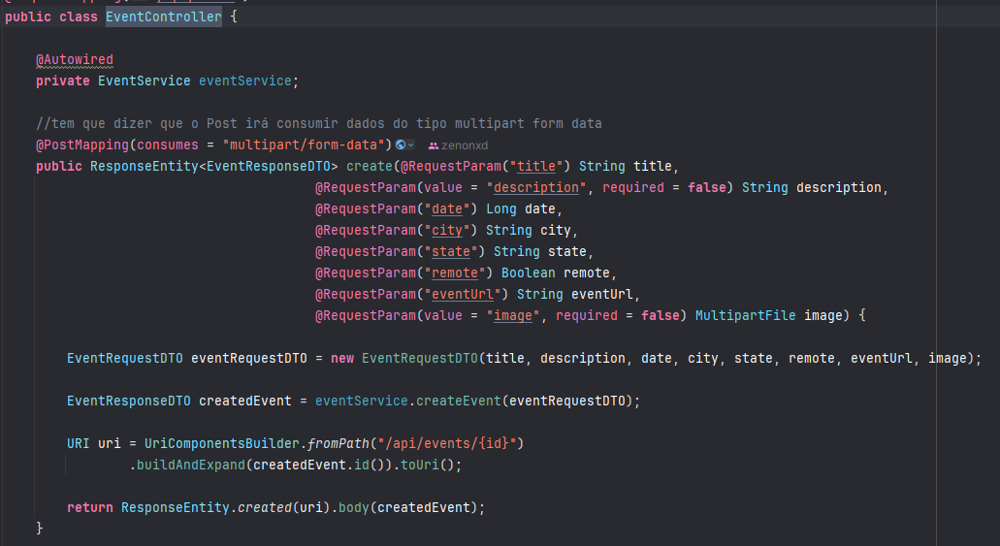

### Requisição Postman teste

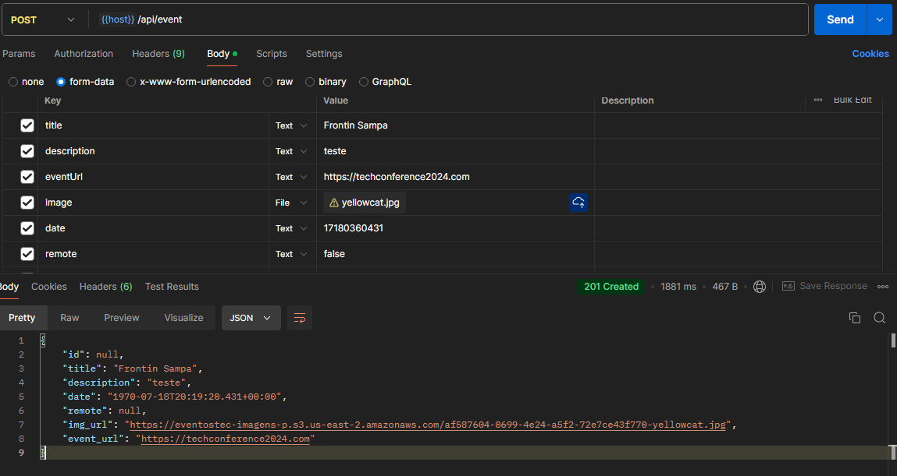


## Associando cupom a um evento

Faremos a mesma coisa: um CouponRequestDTO para receber os dados do Cupom no Controller e um CouponResponseDTO, 
retornando os dados adicionais (id e evento).

### Service

Criar CouponService.

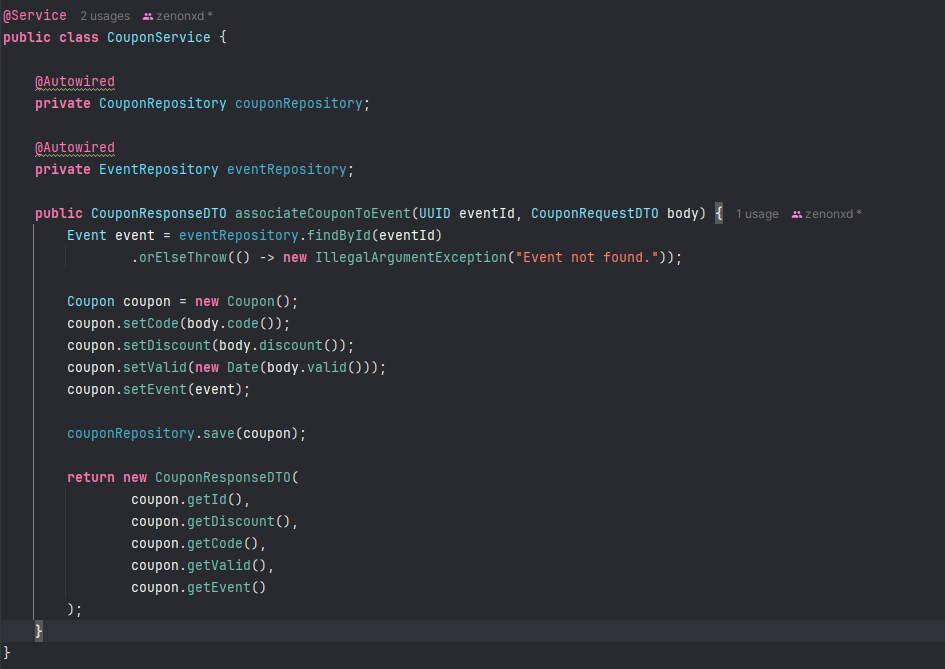

### Controller

Criar CouponController.

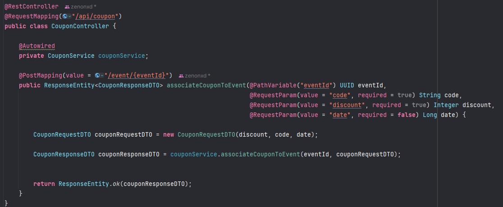


## Listagem de eventos cadastrados (Pageable)

### Service

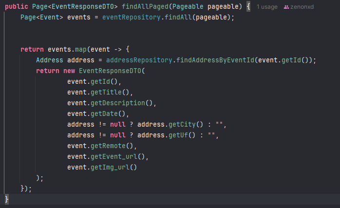

### Controller

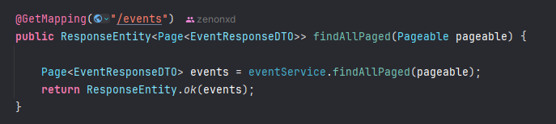

## Listagem de upcoming events

### Repository

### Service

### Controller

## Criando address

### Repository

### Service

### Controller

## Filtered Events

Este método fará um filtro por data, local e título do evento.

Criaremos um método no EventRepository.

### Repository

Teremos como parâmetro a nossa data atual, cidade, uf, data de começo e término.

Essa query será elaborada da seguinte forma.

1. Primeiro, faremos um Join das duas tabelas (Event e Address), pois será uma consulta feita em ambas tabelas.

2. Depois do Join, faremos a comparação se as informações são parecidas.

Se o "e.title" < título do banco de dados, for parecido com o título que passamos como parâmetro, iremos retorná-lo,
caso contrário será null. Será o mesmo para os outros atributos.

E outra, não é para comparar se é IGUAL e sim "LIKE", por isso, estamos falando parecido.

### Service

### Controller

## FindEventById (com lista de cupom)

### Repository

### Service

### Controller


# Configurando AWS para subir a aplicação

## Criando VPC

Criaremos uma VPC (virtual private cloud). Ou seja, uma sessão lógica para colocar os nossos recursos na AWS.

Imagine uma faculdade. Uma faculdade poderá ter vários cursos! A AWS em tese pode ser vista como uma faculdade.

Dentro dela, poderemos criar "cursos" e cada curso terá suas regras e seus controles. 

Na VPC poderemos criar sub redes, tendo controle total dela, controle de ip (quem entra e quem sai).

Digite VPC na barra de pesquisa e crie um VPC.

**Nome:** eventostec-vpc

**Ipv4 CIDR** - Define o tamanho do bloco de Ips que teremos dentro da nossa VPC (ela terá controle TOTAL da rede). 
Colocaremos o valor de ``10.0.0.0/23`` (isso dará 512 endereços ips disponíveis). Crie a VPC.

## Criando gateway de internet

Gateways de internet são os componentes dentro da nossa VPC que irão permitir a comunicação da nossa rede dentro da VPC
com a internet. Serão o ponto de saída de todo o tráfego para a internet.

É possível ver no desenho que o gateway está logo na entrada do desigeventostec-vpcn, como se fosse o "porteiro".

No lado esquerdo, vá até ``internet gateways``.

Crie um internet gateway, se chamará ``eventostec-gtw``.

Vá em actions > associe o gateway à VPC.

## Criando subrede

Subredes são divisões lógicas dentro da nossa VPC, ela irá nos permitir que a gente segmente a nossa VPC em redes
menores. Além disso, será possível fazer um controle de segurança para essas redes menores.

Poderemos ter então:

1. Uma subnet privada que não está exposta na internet; 
2. Subnet pública, onde teremos uma conexão com ela.

Ou seja, subnets servem para ser possível fazer segregações dentro da VPC. Lembra do exemplo de faculdade? Imagine a
VPC como a coordenadora do curso (que manda em todo o curso de computação) e a subnet (subrede) sendo cada uma das 
materias dentro da computação.

Na subnet será possível também faze o controle do range de endereços de IP que estão dentro da subnet.

Ou seja, quando criarmos a nossa subrede precisaremos associar ela a uma VPC.

### Subrede pública

No lado esquerdo, vá até subredes, crie uma associando a VPC que criamos acima.

**Essa subnet será pública,** onde iremos atrelar o nosso EC2 (ele estará publicamente acessível).

**Seu nome será:** ``eventostec-rede-publica``.

**Além disso, especificaremos o ``bloco DIR IPv4 da sub rede``** (é a fatia que ela vai recolher do valor que colocamos
na VPC, ``10.0.0.0/23``). Daremos o valor de ``10.0.1.0/24``! Ou seja, daqueles 512 ips, pegaremos somente 256 
(os últimos), os outros 256 primeiros serão para a subnet privada.

**Zona de disponibilidade**: será us-east-1a (uma zona física).

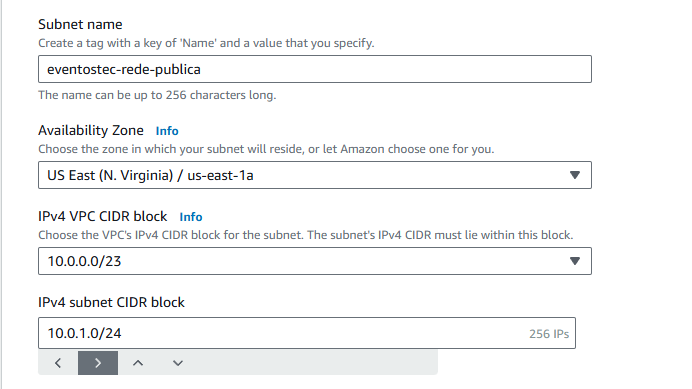

### Subrede privada

Crie outra VPC, será privada.

**Seu nome será:** ``eventostec-rede-privada``.

Seu subnet blocks serão ``10.0.0.0/24`` para pegar os PRIMEIROS 256 Ips, já que a rede privada pega os ultimos.

**Zona de disponibilidade** (será diferente da rede pública): será us-east-1b

Crie a subrede.

## Mapeando gateway para tabela de rotas

Vá até as VPCs e crie na que criamos. Vá até tabela de rotas, clique e abra a nova guia.

Vá em editar todas > adicione uma nova rota > selecione ``0.0.0.0/0`` > gateway da internet > selecione o gateway que
criamos.

Logo, todo o tráfego que vier de fora, redirecionaremos para um gateway de internet. Assim, o gateway estará atrelado
a VPC.

Agora, temos as subnet atreladas a tabela de rotas que por sua vez, está atrelada e a rede (gateway de internet).

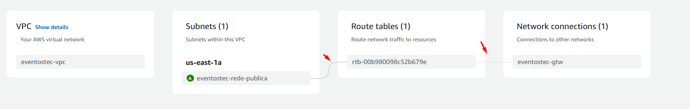

### Subrede privada

## Criando recurso - serviço (EC2)

Digite EC2 na barra de pesquisa.

Vá em instâncias > execute execução.

**Seu nome será:** ``java-service-eventostec``

**Sistema operacional:** Amazon Linux.

**Arquitetura:** Padrão.

**Tipo de instância:** Padrão (t2 micro).

### Par de Chaves

Par de chave é um SSH que usaremos para nos conectarmos com essa instância depois. Essa instância é uma máquina virtual
que será criada na AWS. 

Eventualmente precisaremos nos conectar a ela, para instalar algumas coisas, rodar aplicação, etc.

Para nos conectar de forma remota podemos usar:

- Shell;
- Terminal do computador, através de SSH, rodando comandos.

**Par de chaves:** crie um ou selecione um já existente.

### Conexão de Rede

Vá em editar, e coloque a VPC que criamos (não deixa a padrão). Selecione também a subnet onde a máquina irá nascer 
(coloque a que criamos).

Coloque habilitado para o IP ser atribuído automaticamente.

### Criar grupo de segurança

Ele irá controlar quais recursos a nossa instância pode consultar, o que pode acessar, qual tráfego receber.

Seria um firewall a nível de serviço.

Crie um novo grupo chamado eventostec-ec2-sg (sg = security group).

Descrição: EventosTec Java Service Security Group.

#### Regras grupo de segurança

Permita configurações de SSH (de qualquer lugar), comunicações HTTP (de qualquer) e HTTPS (qualquer lugar).

Coloque também regra de TCP customizado (de qualquer lugar), permitindo comunicações na porta 8080 (onde rodará 
a aplicação).

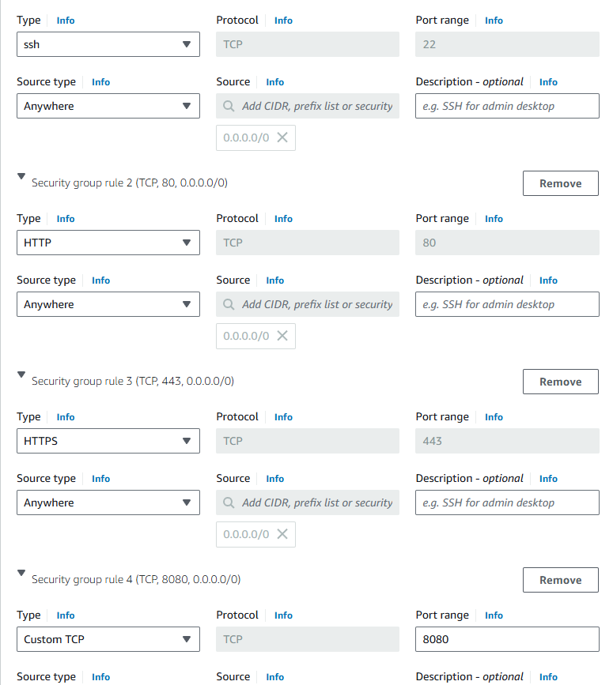

#### Configurar armazenamento 

Coloque padrão.

#### Detalhes avançados

Desça até dados do usuário e coloque este comando:

> #!/bin/bash
> yum update -y
> sudo yum install java-21-amazon-corretto-headless

Isso basicamente é um script que será rodada ao iniciar a instância. Inicialmente, ela estará vazia, então assim que
rodar o java será instalado.

Feito tudo isso, execute a instância!

## RDS (Relational DataBase da AWS) - criando banco relacional

Criaremos nele um banco de dados PostgreSQL.

Vá em criar banco de dados > selecione standard > PostgreSQL.

### Modelos

Em modelos, será nível gratuito ‼️(NÃO ESQUECE DISSO, se não a conta vem! E é caro!!).

### Settings

Altere o nome da database, coloque: ``eventostec-database``

Username será postgres.

Gerenciamento de credenciais: Managed in AWS Secrets Manager - most secure (pra ele criar a senha).

### Configuração instância

Deixa tudo padrão.

### Armazenamento 

Deixa tudo padrão.

### Conectividade

Coloque para conectar o RDS a um recurso (instância do EC2) e marque a instância que está rodando. 

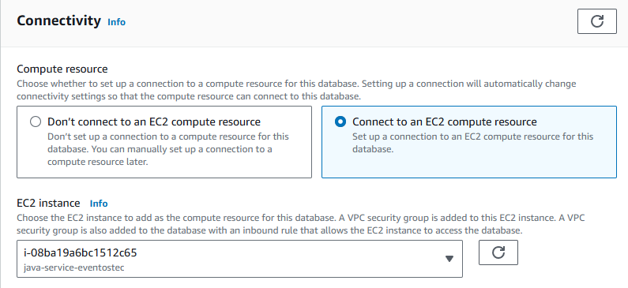

‼️Ao fazer isso, automaticamente ele irá criar um security group que controla o acesso do EC2 ao RDS. Precisamos 
alterar algumas coisas, permitindo que o EC2 acesse o RDS.

#### VPC security group (firewall)

Coloque para criar novo.

Criaremos um security group específico para o nosso RDS (para controlar as seguranças do nosso banco).

### Monitoramento

Desmarca.

E crie o banco de dados! Ele vai demorar um tempo para aparecer o localhost e as credenciais.

## Colocando informações AWS na aplicação

Coloque a url do banco no app.properties, assim como a senha.

Para pegar a senha vá em configurações do RDS e em "retrieve secret value".

### IAM

Vá em funções (roles) e crie um perfil para usar no EC2, para que ele tenha acesso ao nosso S3. Afinal o EC2 vai 
impulsionar dados dentro do bucket do S3.

Selecione um serviço da AWS > EC2 e coloque para ele ter AmazonS3FullAccess.

Assim, criaremos credenciais para os nossos serviços.

O nome da role será EC2ServiceS3FullAccess

### EC2

Volte para o EC2, vá na nossa instância criada > ações > segurança > modificar função IAM > coloque a que criamos.

## Modificações pré-build

Antes de fazer o build da aplicação, vamos fazer umas modificações no código em virtude dos testes unitários.

Coloque a dependência do H2 para realizar os testes unitários (para que não seja utilizado o banco do RDS).

Já sabemos, só criar um ``application-test.properties`` para que seja usado as configurações para se conectar ao
banco H2.

No nossa classe main de test, colocamos o profile para o properties de test:

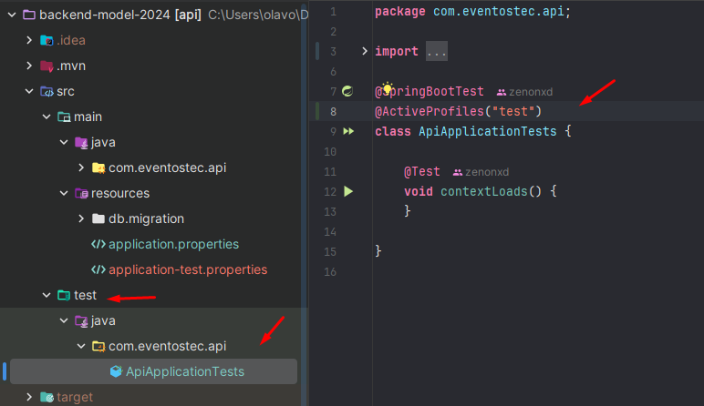

Dê o comando maven: 

>mvn clean install

Copiaremos o arquivo de build para a máquina do EC2.

Primeiro, teste a conexão com a instãncia do EC2. Vá no EC2 > Instances > InstanceID > Connect (campo superior direito).

Pegaremos o IP público (ec2-user...) para conectar via SSH.

Vá no terminal e crie um terminal para conectar a uma nova ``SSH Session``. Preencha os campos corretamente e conecte-se.

Digite java --version para identificar se ele foi instalado, caso não tenha sido, digite ``sudo yum install java-21-amazon
-correto-headless`` e digite ``y`` para confirmar.

Para encerrar a conexão digite ``exit``.

## Copiando arquivo JAR para maquina do EC2

O arquivo está dentro do pacote target.

Use o comando abaixo para copiar o arquivo para a máquina virtual.

>scp -i C:\Users\SEUPC\.ssh\suaKEY.pem .\target\api-0.0.1-SNAPSHOT.jar ec2-user@oIPaqui:/home/ec2-user

Para se conectar: 

> ssh -i C:\Users\seuPC\.ssh\suaKEY.pem ec2-user@IpAqui


Com o arquivo lá dentro, só dar o comando:

> java -jar api-0.0.1-SNAPSHOT.jar

‼️ Para que não dê nenhum problema de conexão com o banco de dados:

Vá até o RDS > databases > clique na data base > scrolla até o final (Security group rules (1)) > clique no security
group (vai abrir uma outra guia) > clique no security group ID > edit inbound rules > adicione regra de (Todo tráfego)
que vier do security group.

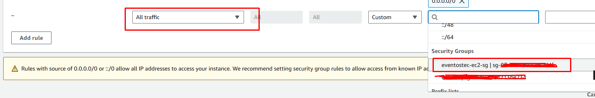

## Para testar

Vá até o EC2, pega o IP público e vá até o Postman para testar as requisições.

Ip será: ``ipdoec2:8080/api/event``